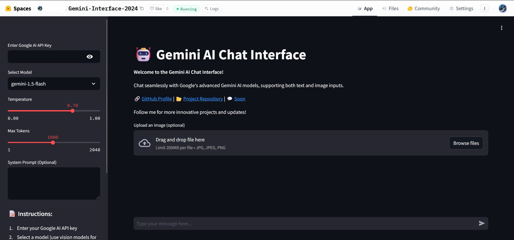

# Gemini AI Chat Interface

This is a simple Python-based interface to interact with Google's Gemini AI models. It supports both text and image inputs and provides a seamless chat experience. The app is hosted as a demo on [Hugging Face](https://huggingface.co/).

## Features

- **Chat with Gemini Models**: Supports various Gemini models, including vision-enabled ones.
- **Image Analysis**: Upload images to enhance the conversation with AI. Like with Flash 1.5
- **Customizable Settings**: Adjust temperature, max tokens, and add system prompts for tailored interactions.
- **Interactive UI**: Built with Streamlit for an intuitive user experience.
- **Uee your own API-Key**

## Demo

Try the app hosted on Hugging Face: [Gemini AI Chat](https://huggingface.co/spaces/Alibrown/Gemini-Interface-2024).



## Setup Instructions

Follow these steps to run the app locally:

1. **Clone the Repository**:
    ```bash
    git clone https://github.com/volkansah/gemini-ai-chat.git
    cd gemini-ai-chat
    ```

2. **Install Dependencies**:
    Make sure you have Python 3.7 or newer installed.
    ```bash
    pip install -r requirements.txt
    ```

3. **Run the App**:
    ```bash
    python app.py
    ```

4. **Access the App**:
    Open your browser and navigate to `http://localhost:8501`.

## How to Use

1. Enter your Google AI API key in the sidebar.
2. Select a model:
    - For text interactions, choose models without "vision".
    - For image-related tasks, use vision-enabled models (e.g., `gemini-1.5-pro-vision-latest`).
3. Adjust the `temperature` and `max tokens` settings for desired output style.
4. Optionally, provide a system prompt to guide the AI's behavior.
5. Upload an image (optional) for vision-based analysis.
6. Type your message in the input box and press Enter.

## Code Overview

The app uses:
- **Streamlit**: For creating the interactive web UI.
- **Google Generative AI Python SDK**: To connect with Google's Gemini models.
- **Pillow**: For image processing.
- **Base64 Encoding**: To handle image data.

For more details, see the code in [`app.py`](app.py).

## Issues and Contributions

If you encounter any issues or have suggestions, feel free to [open an issue](https://github.com/volkansah/gemini-ai-chat/issues) or contribute by submitting a pull request.

## License

This project is licensed under the GPL3 License. See the [LICENSE](LICENSE) file for details.

---

Created by **Volkan Kücükbudak**. Follow me on [GitHub](https://github.com/volkansah) for more exciting projects!

